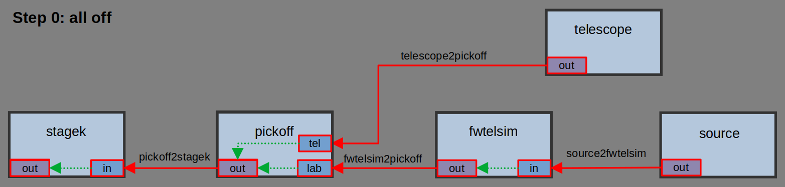
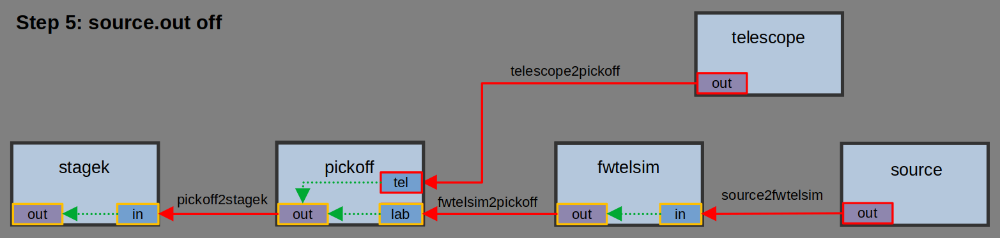
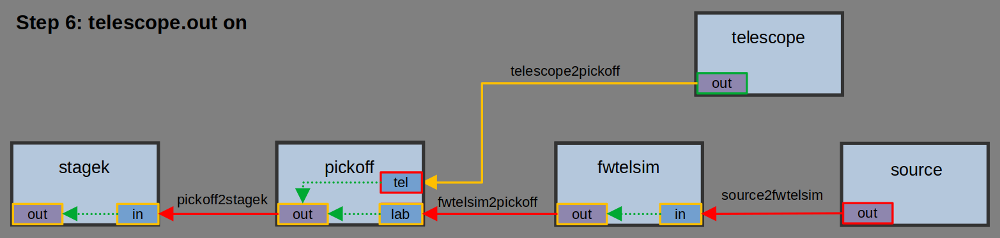
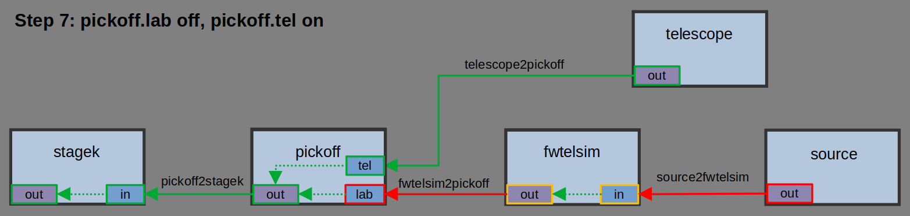

# Demo 2: drawio XML

This demo illustrates the logic of the inputs to the MagAO-X instrument.  The source can be either the internal telescope simulator, starting at the node `source`, which is a laser, or the node `telescope` which represents the, well, telescope.

Here we specify the graph using a `drawio` XML file.  This will soon enable GUI updates.

## Building

The demo can be compiled from inside the demo directory with

```
$ g++ -o demo2 demo2.cpp ../src/*.cpp 
```

## Running

Run the demo with

```
$ ./demo2
```

This loads the instrument graph specified in `demo1.toml`.  The program currently gives verbose output describing what it's doing to load and construct the graph, and then dumps a simplified representation of what was loaded.  The level of verbosity will be changeable in the future.

The basic code needed here is
```c++
#include "../instGraph.hpp"

int main()
{
    ingr::instGraph igr;
    igr.constructFromTOMLFile("demo1.toml");

    ...
```

## The Demo Steps

Once the graph is loaded, then a series of steps are executed showing how changes to the instrument's node's states affect the propagation of light through the instrument.

Each step is illustrated with a diagram of the instrument graph.  The legend for the diagrams is provided here.


### Step 0:

For Step 0 all the puts are in the default state of off.  The beams are therefor off.  The demo outputs

```
  source2fwtelsim state   = off
  fwtelsim2pickoff state  = off
  telescope2pickoff state = off
  pickoff2stagek state    = off
```



### Step 1:

The source is turned on with
```c++
igr.node("source").output("out").state(ingr::putState::on);
```
This causes the beam `source2fwtelsim` to become intermediate.  The demo outputs
```
  source2fwtelsim state   = int
  fwtelsim2pickoff state  = off
  telescope2pickoff state = off
  pickoff2stagek state    = off
```
and the graph looks like:


### Step 2:

The `fwtelsim` input `in` is turned on with
```c++
igr.node("fwtelsim").input("in").state(ingr::putState::on);
```
Because of the `outputLink` to the output `out` it is also turnred on.  This causes the beam `source2fwtelsim` to switch on, and the beam `fwtelsim2pickoff` to become intermediate since it has nowhere to go.

The demo outputs:
```
  source2fwtelsim state   = on
  fwtelsim2pickoff state  = int
  telescope2pickoff state = off
  pickoff2stagek state    = off
```
and the graph looks like


### Step 3:

Now the kmirror `stagek` input is turned on.  
```c++
igr.node("stagek").input("in").state(ingr::putState::on);
```
This causes it to become `waiting` since the beam `pickoff2stagek` is off.  This causes `stagek.out` to also become `waiting`.

The demo outputs
```
  stagek.in state  = waiting
  stagek.out state = waiting
  source2fwtelsim state   = on
  fwtelsim2pickoff state  = int
  telescope2pickoff state = off
  pickoff2stagek state    = off
```
and graphically:


### Step 4:

Now `pickoff` (a mirror on a linear stage with two positions) is set to the `lab` position, which logically corresponds to the input `pickoff.lab` turning on.  
```c++
igr.node("pickoff").input("lab").state(ingr::putState::on);
```
Now the beam propagates all the way to `stagek.out`, with inputs and outputs in the waiting state automatically turning on. The demo outputs
```
  stagek.in state  = on
  stagek.out state = on
  source2fwtelsim state   = on
  fwtelsim2pickoff state  = on
  telescope2pickoff state = off
  pickoff2stagek state    = on
```
and the graph looks like


### Step 5:

Now the source is turned off.  
```c++
igr.node("source").output("out").state(ingr::putState::off);
```
Now all beams are `off`, and downstream inputs and outputs become `waiting`.  The demo outputs
```
  pickoff.lab state  = waiting
  stagek.in state  = waiting
  stagek.out state = waiting
  source2fwtelsim state   = off
  fwtelsim2pickoff state  = off
  telescope2pickoff state = off
  pickoff2stagek state    = off
```
and the graph is


### Step 6:
Now the telescope output is turned on.  This is the logical equivalent of pointing at a star with the dome open.
```c++
igr.node("telescope").output("out").state(ingr::putState::on);
```
The beam `telescope2pickoff` is now intermediate because we have not configured the instrument for on-sky operation.

Demo output:
```
  source2fwtelsim state   = off
  fwtelsim2pickoff state  = off
  telescope2pickoff state = int
  pickoff2stagek state    = off
```

Graph state:


### Step 7:
Finally, the pickoff mirror is moved to the telescope position.  Logically this corresponds to `pickoff.lab` being `off` and `pickoff.tel` being `on`.

```c++
igr.node("pickoff").input("lab").state(ingr::putState::off);
igr.node("pickoff").input("tel").state(ingr::putState::on);
```
The beam now propagates all the way to `stagek.out` automatically.

Demo output:
```
  source2fwtelsim state   = off
  fwtelsim2pickoff state  = off
  telescope2pickoff state = on
  pickoff2stagek state    = on
```

Graph state:

